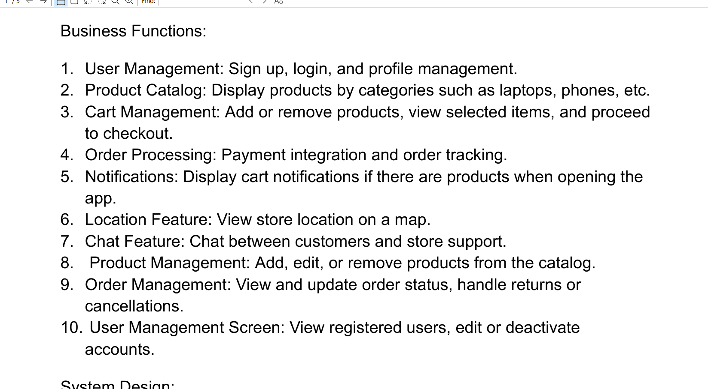

# EComBE

# Frontend : [EComFE](https://github.com/Kiennt1699/EComFE_remake)

Link design: [DESIGN ECOM](https://www.canva.com/design/DAGRitflw30/jgZpfaew30bXz1_ny6CEqQ/edit?utm_content=DAGRitflw30&utm_campaign=designshare&utm_medium=link2&utm_source=sharebutton)

## Link backend : reinir.mooo.com:5001 / 3.27.151.161:5001

## File server

### Để lưu : reinir.mooo.com:8888

gửi POST tới đó với enctype=multipart/form-data là nó trả về cái filename

> curl -X POST -F "file=@./test.jpg" http://reinir.mooo.com:8888
> nó trả về : {"filename": "uploaded_image_1729160653.jpg"}

### Để lấy : GET reinir.mooo.com:5002/{filename}

>  http://reinir.mooo.com:5002/uploaded_image_1729160653.jpg

## Ai cần connect tới database / server die thì chat riêng với Trung

## Làm ơn không push login/password của db lên github

# Work Breakdown Structure (WBS)

Legend :
* miniFE : mobile code, but doesnt count as a page
* FE : A page in Mobile
* BE : C# api + Database
* WebFE : C# page

## 0. Project Planning and Setup
- 1.1 Define project scope and objectives
- 1.2 Set up version control
- 1.3 Database set up
- 1.4 Task assignment and scheduling
- 1.5 Wireframe creation
- 1.6 Finalize app color scheme, fonts, and theme + setup (miniFE)
- 1.7 Landing page implementation (FE)
- 1.8 Main navigation bar setup (miniFE)

## 1. User Authentication and Security
- 3.1 Implement user registration (email, phone, Google sign-in) (FE, BE)
- 3.2 Implement user login, logout with JWT-based authentication (FE, BE)
- 3.3 Profile Management (FE, BE)

## 2. Product Catalog
- 4.0 Home page implementation (FE, BE)
- 4.1 Create product listing screen (FE, BE)
- 4.2 Product details screen with images and descriptions (FE, BE)
- 4.3 Implement product search functionality, Categorization and filtering of products (miniFE, BE)

## 3. Shopping Cart
- 3.1 Implement "Add to Cart" feature (miniFE, BE)
- 3.2 Shopping cart screen (FE, BE)
- 3.3 Wishlist feature (FE, BE)

## 4. Check out
- 4.1 Payment gateway integration (e.g., PayPal, Stripe) (FE, BE)
- 4.2 Order summary and confirmation screen (FE, BE)
- 4.3 Order history and tracking (FE, BE)

## 5. Notifications
- 5.1 Notifications at interval if there are products in the cart (miniFE, BE)
- 5.2 Notifications if new products are added (miniFE, BE)

## 6. Ultility
- 6.1 View Location on a map (FE)
- 6.2 Chat between staff and customers (FE, BE)

## 7. Admin dashboard for Product Management
- 7.1 Admin product listing + search (FE, WebFE, BE)
- 7.2 Add product to Catalog (WebFE, BE)
- 7.3 Remove product from Catalog (WebFE, BE)
- 7.4 Edit product (WebFE, BE)

## 8. Admin dashboard for Order Management
- 8.1 Order listing and search (FE, WebFE, BE)
- 8.2 Handle return and cancellation (FE, WebFE, BE)
- 8.3 Update order status (FE, WebFE, BE)

## 9. Admin dashboard for User Management
- 9.1 User profile listing + search (FE, WebFE, BE)
- 9.2 Edit or deactivate accounts (WebFE, BE)
- 9.3 Create staff account (WebFE, BE)
- 9.4 Notifications and preferences management (FE, WebFE, BE)

## 10. Testing and Quality Assurance
- 10.1 Unit testing for each module
- 10.2 Integration testing
- 10.3 Bug fixing and performance optimization

## 11. Project Documentation
- 11.1 Technical documentation
- 11.2 Final project report
